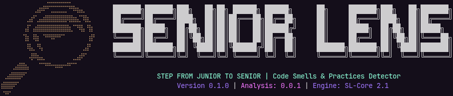

# SeniorLens 🕵️‍♂️


SeniorLens is an open-source CLI tool and Git-integrated code review system built entirely in **Go**. It analyzes your code and commit history to detect bad patterns, flag weak commits, and track your progression from junior to senior developer—all running locally, with **zero cloud dependency**.

## 🚀 Purpose

Stop relying on external SaaS for code quality. SeniorLens provides a private, local-first path to seniority by auditing your development habits directly from your local machine or a dedicated home server.

## ✨ Key Features

- **Local-First Analysis**: Your code never leaves your network. 
- **Git Integration**: Deep analysis of commit history and message quality.
- **Pattern Detection**: Identifies "junior" anti-patterns and suggests "senior" refactors.
- **Progression Tracking**: Visualizes your growth over time across different repositories.
- **Raspberry Pi Optimized**: Lightweight enough to run as a 24/7 background auditor on a Pi.

## 📥 Installation

```bash
go install github.com/lukas-sgx/seniorlens@latest
```

*Note: Ensure your `$GOPATH/bin` is in your `PATH`.*

## 🛠 Usage

### Initialize SeniorLens in a Repository
```bash
seniorlens init
```

### Analyze Current State
```bash
seniorlens check
```

### View Progression Dashboard (Terminal UI)
```bash
seniorlens dashboard
```

## 🏗 Roadmap

- [ ] Support for more languages (Initial focus on Go and Python)
- [ ] Integration with local LLMs (Ollama) for deeper semantic analysis
- [ ] Web-based local dashboard for historical trends
- [ ] Peer-to-peer review "Lens" for local network collaboration

## 🤝 Contributing

SeniorLens is open-source. We welcome contributions that help developers level up!

1. Fork the Project
2. Create your Feature Branch (`git checkout -b feature/AmazingFeature`)
3. Commit your Changes (`git commit -m 'Add some AmazingFeature'`)
4. Push to the Branch (`git push origin feature/AmazingFeature`)
5. Open a Pull Request

## 📄 License

Distributed under the MIT License. See `LICENSE` for more information.
